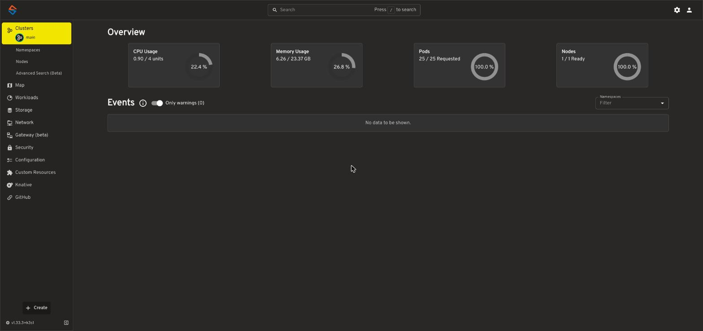
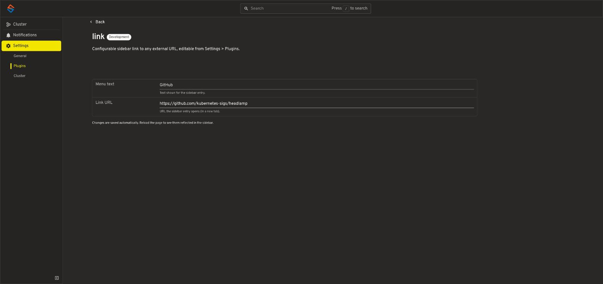

# headlamp-menu-link

A small [Headlamp](https://github.com/kubernetes-sigs/headlamp) plugin that
adds one configurable link to the sidebar menu, pointing at any external
URL you like. Both the menu text and the target URL are editable live from
**Settings > Plugins > link** inside Headlamp itself — no rebuild or
redeploy needed to change them.

Defaults to a "GitHub" entry linking to
[kubernetes-sigs/headlamp](https://github.com/kubernetes-sigs/headlamp)
until you configure it.

## Why

Headlamp doesn't ship a built-in way to add an arbitrary external link to
its sidebar, and no plugin in the
[official `headlamp-k8s/plugins` catalog](https://github.com/headlamp-k8s/plugins)
covers this either. This plugin fills that specific gap: point it at a
dashboard, a runbook, an internal wiki page, anything with a URL.

## What it looks like



- A sidebar entry with a chain-link icon, opening the configured URL in a
  new tab.
- A settings page at **Settings > Plugins > link** with two fields:
  - **Menu text** — the label shown in the sidebar.
  - **Link URL** — where it points.



- Changes save automatically as you type (debounced). A page reload is
  needed for the sidebar to reflect a change, since the plugin only reads
  its configuration once, at startup — the same behavior as Headlamp's own
  official
  [`change-logo`](https://github.com/kubernetes-sigs/headlamp/tree/main/plugins/examples/change-logo)
  example plugin, which this one's settings page is modeled on.

## Installing

Headlamp's built-in plugin manager (Settings > Plugins > "Install plugin
from ArtifactHub URL") only accepts plugins published to
[ArtifactHub](https://artifacthub.io/packages/search?kind=18). This plugin
isn't published there, so it needs to be built and installed manually.

### 1. Build

```bash
git clone https://github.com/klaushofrichter/headlamp-menu-link.git
cd headlamp-menu-link
npm install
npx @kinvolk/headlamp-plugin build
```

This produces `dist/main.js`. To get the exact `main.js` + `package.json`
pair Headlamp's plugin loader expects (a plugin with only `main.js` loads
silently but never registers anything), run:

```bash
npx @kinvolk/headlamp-plugin extract . ./output
```

which writes `output/link/main.js` and `output/link/package.json`.

### 2a. Headlamp Desktop

Copy the `output/link/` folder into Headlamp's user-plugins directory and
restart Headlamp:

- **Linux**: `~/.local/share/Headlamp/user-plugins/link/` (or
  `~/.config/Headlamp/user-plugins/link/` if the data directory doesn't
  exist yet)
- **macOS**: `~/Library/Application Support/Headlamp/user-plugins/link/`
- **Windows**: `%APPDATA%\Headlamp\user-plugins\link\`

(Headlamp resolves this path via the standard
[`env-paths`](https://www.npmjs.com/package/env-paths) OS conventions -
see `defaultUserPluginsDir()` in
[`headlamp-k8s/headlamp`'s `plugin-management.ts`](https://github.com/kubernetes-sigs/headlamp/blob/main/app/electron/plugin-management.ts)
if your install uses a nonstandard config location.)

### 2b. Headlamp in-cluster (Helm chart)

The chart's `pluginsManager` sidecar has the same ArtifactHub-only
restriction, so this plugin has to be mounted into the pod directly instead.
The pattern that works: bake `output/link/{main.js,package.json}` into a
`ConfigMap`, then add a small `initContainer` to the Headlamp `Deployment`
(via the chart's `initContainers`/`volumes` values) that copies both files
into the same shared `plugins-dir` `emptyDir` volume the main container and
(if enabled) the `pluginsManager` sidecar already mount at
`/headlamp/plugins` — Headlamp's plugin loader doesn't care how a plugin
got into that directory. Sketch:

```yaml
volumes:
  - name: link-plugin-src
    configMap:
      name: headlamp-plugin-link  # kubectl create configmap ... --from-file=main.js --from-file=package.json

initContainers:
  - name: install-link-plugin
    image: busybox:1.36
    command:
      - sh
      - -c
      - mkdir -p /headlamp/plugins/link && cp /link-plugin-src/main.js /link-plugin-src/package.json /headlamp/plugins/link/
    volumeMounts:
      - name: link-plugin-src
        mountPath: /link-plugin-src
      - name: plugins-dir
        mountPath: /headlamp/plugins
```

## Configuring

Open Headlamp, go to **Settings > Plugins > link**, set the menu text and
URL, then reload the page.

## Developing

```bash
npm install
npm start
```

runs the plugin in watch mode against a running Headlamp instance. See
Headlamp's own [plugin development docs](https://headlamp.dev/docs/latest/development/plugins/)
for the general workflow.

## Relationship to the official Headlamp project

This is an independent, community plugin - it isn't part of, endorsed by,
or distributed through the official
[`headlamp-k8s/plugins`](https://github.com/headlamp-k8s/plugins) catalog
or the [Headlamp project](https://github.com/kubernetes-sigs/headlamp)
itself. If you're looking for the officially maintained plugins, start
there.

## License

[MIT](./LICENSE)
