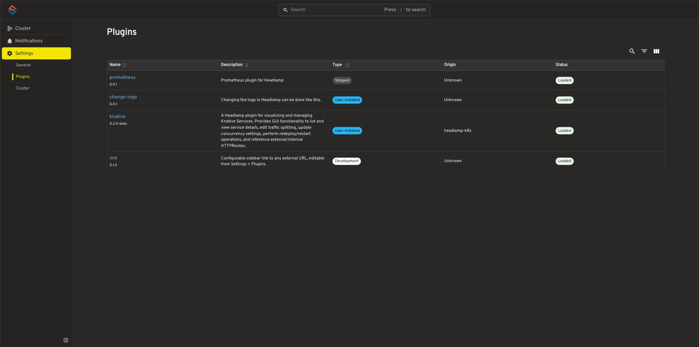

# headlamp-menu-link

A small [Headlamp](https://github.com/kubernetes-sigs/headlamp) plugin that
adds one configurable link to the sidebar menu, pointing at any external
URL you like. Both the menu text and the target URL are editable live from
**Settings > Plugins > link** inside Headlamp itself — no rebuild or
redeploy needed to change them.

Defaults to a "GitHub" entry linking to
[kubernetes-sigs/headlamp](https://github.com/kubernetes-sigs/headlamp)
until you configure it.

## Why

Headlamp doesn't ship a built-in way to add an arbitrary external link to
its sidebar, and no plugin in the
[official `headlamp-k8s/plugins` catalog](https://github.com/headlamp-k8s/plugins)
covers this either. This plugin fills that specific gap: point it at a
dashboard, a runbook, an internal wiki page, anything with a URL.

## What it looks like


- A sidebar entry with a chain-link icon, opening the configured URL in a
  new tab.
- A settings page at **Settings > Plugins > link** with two fields:
  - **Menu text** — the label shown in the sidebar.
  - **Link URL** — where it points.


- Changes save automatically as you type (debounced). A page reload is
  needed for the sidebar to reflect a change, since the plugin only reads
  its configuration once, at startup — the same behavior as Headlamp's own
  official
  [`change-logo`](https://github.com/kubernetes-sigs/headlamp/tree/main/plugins/examples/change-logo)
  example plugin, which this one's settings page is modeled on.

## Installing

### Prerequisites

- **Node.js** v22.0.0 or later
- **npm** v11.0.0 or later
- A running Headlamp instance ([desktop app](https://headlamp.dev/docs/latest/installation/desktop/)
  or in-cluster)

Headlamp's built-in plugin manager (Settings > Plugins > "Install plugin
from ArtifactHub URL") only accepts plugins published to
[ArtifactHub](https://artifacthub.io/packages/search?kind=21). This plugin
isn't published there yet, so for now it needs to be built and installed
manually - see [Building & Shipping Plugins](https://headlamp.dev/docs/latest/development/plugins/building/)
for the general approach this follows.

### 1. Build and package

```bash
git clone https://github.com/klaushofrichter/headlamp-menu-link.git
cd headlamp-menu-link
npm install
npm run build
npm run package
```

`npm run package` bundles `dist/main.js` + `package.json` into a
`link-<version>.tar.gz` tarball in the format Headlamp expects, and prints its
SHA256 checksum.

### 2a. Headlamp Desktop

Extract the tarball into Headlamp's plugins directory and restart Headlamp:

| OS | Plugins directory |
|----|--------------------|
| Linux | `~/.config/Headlamp/plugins/` |
| macOS | `~/.config/Headlamp/plugins/` |
| Windows | `%APPDATA%\Headlamp\Config\plugins\` |

```bash
mkdir -p ~/.config/Headlamp/plugins/
tar xvf link-<version>.tar.gz -C ~/.config/Headlamp/plugins/
```

(Paths per Headlamp's own [Building & Shipping Plugins](https://headlamp.dev/docs/latest/development/plugins/building/)
docs - Headlamp Desktop also has a Plugin Catalog for installing plugins
already published to ArtifactHub, which this one isn't yet.)

### 2b. Headlamp in-cluster (Helm chart)

The chart's `pluginsManager` sidecar has the same ArtifactHub-only
restriction, so this plugin has to be mounted into the pod directly instead.
Extract the tarball first to get the plain `main.js`/`package.json` pair:

```bash
tar xvf link-<version>.tar.gz
# -> headlamp-menu-link/main.js, headlamp-menu-link/package.json
```

The pattern that works from there: bake those two files into a `ConfigMap`,
then add a small `initContainer` to the Headlamp `Deployment` (via the
chart's `initContainers`/`volumes` values) that copies both files into the
same shared `plugins-dir` `emptyDir` volume the main container and (if
enabled) the `pluginsManager` sidecar already mount at `/headlamp/plugins` -
Headlamp's plugin loader doesn't care how a plugin got into that directory,
or what its folder is named. Sketch:

```yaml
volumes:
  - name: link-plugin-src
    configMap:
      name: headlamp-plugin-link  # kubectl create configmap ... --from-file=headlamp-menu-link/main.js --from-file=headlamp-menu-link/package.json

initContainers:
  - name: install-link-plugin
    image: busybox:1.36
    command:
      - sh
      - -c
      - mkdir -p /headlamp/plugins/link && cp /link-plugin-src/main.js /link-plugin-src/package.json /headlamp/plugins/link/
    volumeMounts:
      - name: link-plugin-src
        mountPath: /link-plugin-src
      - name: plugins-dir
        mountPath: /headlamp/plugins
```

However you install it, Headlamp's Settings > Plugins page will list it once
it's picked up, confirming it loaded correctly:



## Configuring

Open Headlamp, go to **Settings > Plugins > link**, set the menu text and
URL, then reload the page.

## Developing

```bash
npm install
npm start
```

runs the plugin in watch mode against a running Headlamp instance. See
Headlamp's own [plugin development docs](https://headlamp.dev/docs/latest/development/plugins/)
for the general workflow.

Before releasing a new version, this repo follows Headlamp's own
[release readiness checklist](https://headlamp.dev/docs/latest/tutorials/plugin-development/getting-started/releasing-and-publishing/#release-readiness-checklist):

```bash
npm run format
npm run lint
npm run tsc
npm run test
npm run build
npm run package
```

## Branching and releases

- `main` - everyday development.
- `release` - protected; only changes via a reviewed pull request with
  passing checks (lint, typecheck, test, build, and
  [CodeQL](https://codeql.github.com/)). Direct pushes are blocked.
- Merging a PR into `release` automatically builds, packages, tags (from
  `package.json`'s `version`), and publishes a GitHub release with the
  tarball attached and an auto-generated changelog from the merged PRs
  since the last release. Bump the version as part of your PR to publish a
  new release; if it's unchanged, the release step is skipped.

## Publishing status

`artifacthub-repo.yml` and `artifacthub-pkg.yml` are included so this repo
is ready to register on [Artifact Hub](https://artifacthub.io) - the
mechanism Headlamp's built-in Plugin Catalog uses to discover installable
plugins - following the
[official publishing guide](https://headlamp.dev/docs/latest/development/plugins/publishing/).
It isn't registered there yet, hence "Installing" above being manual for
now.

## Relationship to the official Headlamp project

This is an independent, community plugin - it isn't part of, endorsed by,
or distributed through the official
[`headlamp-k8s/plugins`](https://github.com/headlamp-k8s/plugins) catalog
or the [Headlamp project](https://github.com/kubernetes-sigs/headlamp)
itself. If you're looking for the officially maintained plugins, start
there.

## License

[MIT](./LICENSE)
